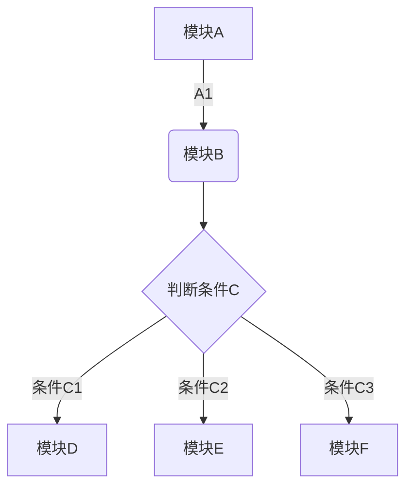

# zobolの计算机操作系统学习札记

#### 写作前言
   [ 往事如烟-作者自序](./Doc/00AuthorForeword/01AuthorIntroduceWangShiRuYan.html)  

   [ 0.1 软件工程学的明珠——OperatingSystem](./Doc/00AuthorForeword/02PearlOfSoftwareEngineering.html)

#### 1.总述
   [1.1 生活中的各种计算机 计算机网络的定义和分类](./Doc/01Summary/0001DefinitionAndClassificationOfComputerNetworks.html)  
  
   [1.2 怎么评价一个计算机网络的好坏？性能指标](./Doc/01Summary/0002PerformanceIndexOfComputerNetwork.html)

#### 2.物理层

   [2.1 物理层是做什么的？](b.html)

   [3.2 物理层是做什么的？](b.html)

#### 2.数据链路层
#### 3.网络层
#### 4.传输层
#### 5.应用层

