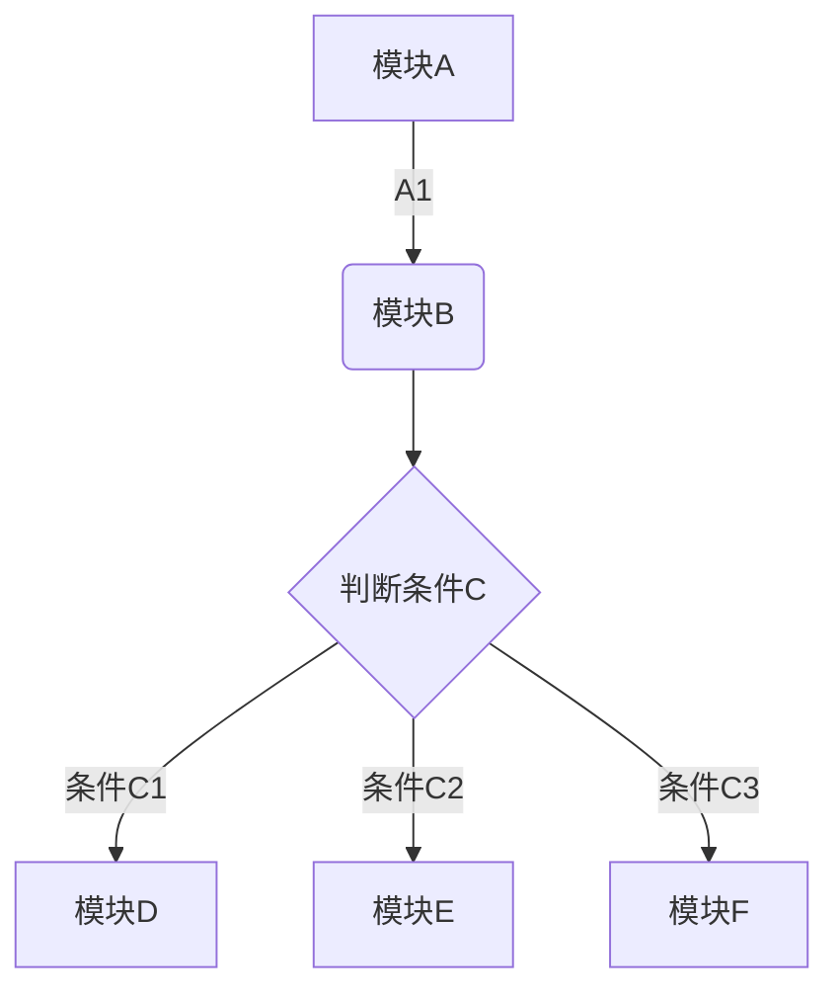

# zobolの计算机操作系统学习札记

#### 写作前言
   [ 往事如烟-作者自序](./Doc/00AuthorForeword/01AuthorIntroduceWangShiRuYan.html)  

   [ 0.1 软件工程学的明珠——OperatingSystem](./Doc/00AuthorForeword/02PearlOfSoftwareEngineering.html)


#### 1.总述  
* [1.1 操作系统的第一个功能——虚拟化硬件资源](./Doc/01Summary/0001TheFirstFeatureVirtualizesHardwareResources.html)  

* [1.2 操作系统的第二个功能——并发功能](./Doc/01Summary/0002TheSecondFunctionConcurrentFunction.html)  
	* 1.2.1 是多少都是
* [1.3 操作系统的第三个功能——存储管理功能](./Doc/01Summary/0003TheThirdFunctionIsStorageManagement.html)  

* [1.4 操作系统的其余功能](./Doc/01Summary/0004.html)  


   [1.2 怎么评价一个计算机网络的好坏？性能指标](./Doc/01Summary/0002TheSecondFunctionConcurrentFunction.html)

   [1.2 怎么评价一个计算机网络的好坏？性能指标](./Doc/01Summary/0002TheSecondFunctionConcurrentFunction.html)

   [1.2 怎么评价一个计算机网络的好坏？性能指标](./Doc/01Summary/0002TheSecondFunctionConcurrentFunction.html)

   [1.2 怎么评价一个计算机网络的好坏？性能指标](./Doc/01Summary/0002TheSecondFunctionConcurrentFunction.html)

#### 2.物理层

   [2.1 物理层是做什么的？](b.html)

   [3.2 物理层是做什么的？](b.html)

#### 2.数据链路层
#### 3.网络层
#### 4.传输层
#### 5.应用层


和无序列表一样，有序列表也有多级结构。
#### 语法
```
1. 这是一级的有序列表，数字1还是1
   1. 这是二级的有序列表，阿拉伯数字在显示的时候变成了罗马数字
      1. 这是三级的有序列表，数字在显示的时候变成了英文字母
```

#### 效果

1. 这是一级的有序列表，数字1还是1
   1.1 这是二级的有序列表，阿拉伯数字在显示的时候变成了罗马数字
      1.1.1 这是三级的有序列表，数字在显示的时候变成了英文字母
	 

### 复选框列表
#### 语法
```


